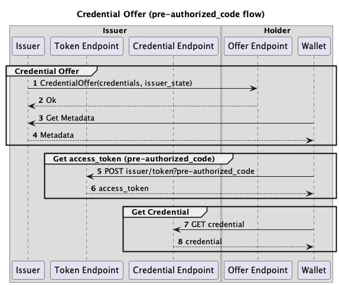

# Prototype for OIDC4VCI

## Resources:
[Notes on the wiki](https://wiki.nuts.nl/books/credential-issuance-and-presentation/page/notes-on-exploring-credential-issuance)


## Scope
Build a prototype for Offering a NutsAuthorizationCredential by an issuer to a holder, using the OIDC4VCI specification.

## Decisions
This section contains topics that were discussed and the decisions made.

- **`code` vs `pre-authentication` flow**.  
  Decision: We only support the `pre-authenticated` code flow for now.  
  Rationale: for directly offering credentials server-to-server the more complicated authorization code flow is not needed, since it protects against stealing the pre-authentication code (e.g. scanning a QR-code 'over the shoulder') or phishing the end-user.
These are not applicable in an offering server-to-server scenario.

- **What to do with client authentication (`client_id`)?**  
  Decision: We should probably support it.
  Rationale: It adds another layer of security since other parties can't use a leaked pre-authorized code, unless they can authenticate as the intended client.

## Prerequisites

- The issuer resolved the wallet's offer endpoint by searching the Nuts registry and looking up Wallet VC Offer Endpoint service (?).

## Request examples
Here we describe all the requests and responses for obtaining the NutsAuthorizationCredential.

In this interaction are 2 roles involved:

**The issuer**:

This is the care organisation that wants to offer a NutsAuthorizationCredential to authorize the another care organisation (Holder) to access patient information.
* Hosted at `https://issuer.example`
* Identified by `did:nuts:<issuer did>`

**Holder**:

This is the care organisation that will be authorized to access the data of the patient.
* Wallet is hosted at `https://wallet.example`
* Identified by `did:nuts:<holder did>`

### Sequence diagram:


### 1. Credential Offer

Step described in [OIDC4VCI 4.1. Credential Offer]( https://openid.net/specs/openid-4-verifiable-credential-issuance-1_0.html#name-credential-offer ).

`GET` request from the issuer to the wallet's Offer Endpoint. Specifies `credential_offer` JSON object as url-encoded query parameter:

```json
{
  "credential_issuer": "https://issuer.example",
  "credentials": [
    {
      "format": "ldp_vc",
      "credential_definition": {
        "@context": [
          "https://www.w3.org/2018/credentials/v1",
          "https://nuts.nl/credentials/v1"
        ],
        "types": [
          "VerifiableCredential",
          "NutsAuthorizationCredential"
        ]
      }
    }
  ],
  "grants": {
    "urn:ietf:params:oauth:grant-type:pre-authorized_code": {
      "pre-authorized_code": "<secret_code>"
    }
  }
}
```

Here we use the `ldp_vc` format, which is defined in [OIDC4VCI E.1.3.3. Credential Offer (JSON-LD)](https://openid.net/specs/openid-4-verifiable-credential-issuance-1_0.html#section-e.1.3.3). It specifies the credential_definition as a JSON-LD object.

Invokes as:

```http request
GET https://wallet.example/offer/credential_offer?credential_offer=<URL encoded offer>
```

Notes:
- Unclear specification for the credential_offer for JSON-LD:
    - _4.1.1. Credential Offer Parameters_ specifies REQUIRED `credentials` parameter to contain the credentials that are offered,
      each one containing `format` and format-specific fields.
    - _E.1.3.3. Credential Offer (JSON-LD)_ specifies these fields for JSON-LD, which specifies REQUIRED `credential_definition`,
      but it is unclear whether this is a top-level field of the credential offer, or a field of the `credentials` entry.  
      Steven: I don't think it is unclear. The `credentials` field should contain a value of list of objects (or strings). And each object should contain a `format` and fields according to that format.
    - It also specifies (again) a `credential_issuer` field. Chosen to put `credential_issuer` again inside the credential spec,
      since the intention is (probably) that the issuer from 4.1.1 is the OIDC4VCI issuer, while the issuer from E.1.1.3 is the JSON-LD VC issuer(?).  
       Steven: I think this is an error in the spec, since nowere this extra field is described.

### 2. Response

The wallet response with `202 - Accepted` without a body.

Notes:
- The response is unspecified by the OIDC4VCI spec.
  Chosen to return `202 - Accepted` without a body since the request is accepted,
  but the Wallet has to decide whether to do something with it.

### 3. Get Metadata

Upon accepting the credential offer, the wallet fetches the Credential Issuer Metadata from the well-known metadata endpoint:

```http request
GET https://issuer.example/.well-known/openid-credential-issuer
```

Notes:

- A domain serving multiple issuers (a vendor serving multiple client care organizations) should map the issuing care
  organization to the issuer URL. E.g., it could use the DID of the care organization as subpath of the issuer URL,
  e.g.: `https://issuer.example/<care_org_did>`. The resulting well-known metadata URL would be:
  `https://issuer.example/<care_org_did>/.well-known/openid-credential-issuer`.  
   Perhaps when/if we transition to the `did:web` method, we can use the did as the basis for the well-known URL e.g. `did:web:issuer.example:123` would result in `https://issuer.example/123/.well-known/openid-credential-issuer`.


### 4. Response

The official `openid-credential-issuer` metadata does not contain the open id connect endpoints which should be requested separately with a call to the `openid-configuration` well-known endpoint. But by combining the information of the `openid-credential-issuer` and `openid-configuration` endpoints, the wallet only has to make 1 request to get all the required information.

The issuer responds with the metadata (`application/json`):

```json
{
  "credential_issuer": "https://issuer.example",
  "issuer": "https://issuer.example",
  "token_endpoint": "https://issuer.example/token",
  "credential_endpoint": "https://issuer.example/credential",
  "credentials_supported": [
    {
      "format": "ldp_vc",
      "@context": [
        "https://www.w3.org/2018/credentials/v1",
        "https://nuts.nl/credentials/v1"
      ],
      "types": [
        "VerifiableCredential",
        "NutsAuthorizationCredential"
      ],
      "cryptographic_binding_methods_supported": "did:nuts"
    }
  ]
}
```

Notes:

- What should the wallet do with the info in `credentials_supported`?
  It won't support anything else than Nuts's VCs for now anyway(?).  
  Proposal: just ignore it.

### 5. Token Request

The wallet requests an access token from the issuer using the `urn:ietf:params:oauth:grant-type:pre-authorized_code` grant type.

```http request
POST https://issuer.example/token
Content-Type: application/x-www-form-urlencoded

grant_type=urn:ietf:params:oauth:grant-type:pre-authorized_code&pre-authorized_code=<secret_code>
```

### 6. Access Token Response

The issuer responds `200 OK` with a `application/json` response, if successful:

```json
{
  "access_token": "eyJhbGciOiJSUzI1NiIsInR5cCI6Ikp..sHQ",
  "token_type": "bearer",
  "expires_in": 300,
  "c_nonce": "tZignsnFbp",
  "c_nonce_expires_in": 300
}
```

### 7. Request NutsAuthorizationCredential

The wallet uses the credential endpoint from the issuer metadata and the acquired access token to request the credential:

```http request
POST https://issuer.example/credential

{
   "format": "ldp_vc",
   "credential_definition": {
      "@context": [
         "https://www.w3.org/2018/credentials/v1",
         "https://nuts.nl/credentials/v1"
      ],
      "types": [
         "VerifiableCredential",
         "NutsAuthorizationCredential"
      ],
   },
   "proof": {
      "proof_type": "jwt",
      "jwt": "eyJraWQiOiJkaWQ6ZXhhbXBsZ...KPxgihac0aW9EkL1nOzM"
   }
}
```

The `jwt` follows the OIDC4VCI RFC, where the `kid` field contains the DID URL of an `authentication` key from the holders DID document.
This key must be used to sign the JWT.

Note:
- Only `jwt` proof type specified as of now?
- `authentication` verification relationship looks like the most fitting, but current Nuts DID documents don't have this one.
  Specifying `authentication` over a relationship which we already use (e.g. `assertionMethod` or `capabilityInvocation`) would involve migration.

### 8. Response NutsAuthorizationCredential

The issuer responds with the issued credential:

```json
{
  "format": "ldp_vc",
  "credential": {
    "@context": [
      "https://www.w3.org/2018/credentials/v1",
      "https://nuts.nl/credentials/v1"
    ],
    "id": "did:nuts:<care organization did>#123",
    "type": [
      "VerifiableCredential",
      "NutsAuthorizationCredential"
    ],
    "issuer": "did:nuts:<care organization did>",
    "issuanceDate": "2010-01-01T00:00:00Z",
    "credentialSubject": {
      "id": "did:nuts:<receiver care organization did>",
      "patient": "bsn:999992",
      "purposeOfUse": "careviewer"
    },
    "proof": {
      "type": "Ed25519Signature2020",
      "created": "2022-02-25T14:58:43Z",
      "verificationMethod": "did:nuts:<care organization did>#key-1",
      "proofPurpose": "assertionMethod",
      "proofValue": "zeEdUoM7m9cY8ZyTpey83yBKeBcmcvbyrEQzJ19rD2UXArU2U1jPGoEtrRvGYppdiK37GU4NBeoPakxpWhAvsVSt"
    }
  },
  "c_nonce": "fGFF7UkhLa"
}
```
