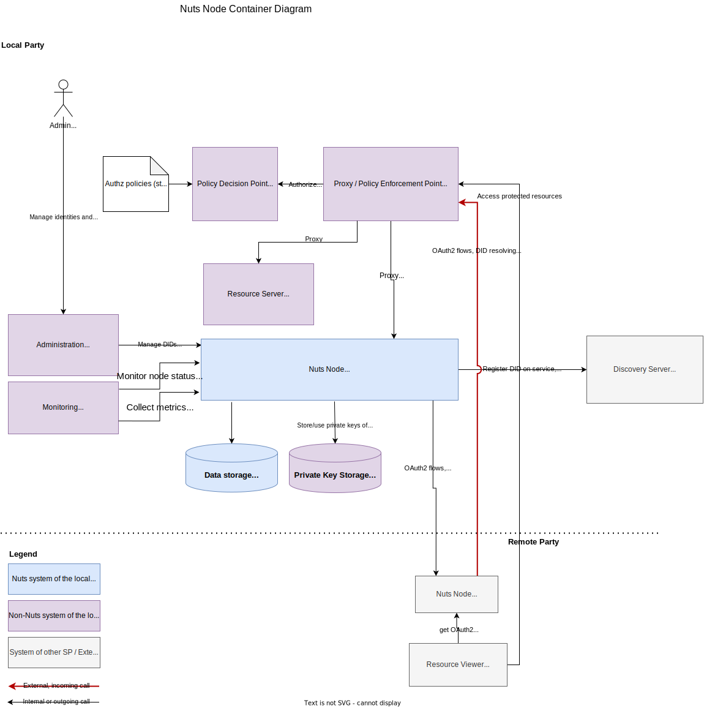

.. _nuts-node-recommended-deployment:

Recommended Deployment
######################

This document aims to describe the systems and their components involved in deploying a Nuts node in a production environment.
The target audience are engineers that want to deploy a Nuts Node in their environment for a Service Provider (SP).

It does not detail services and interfaces specified by Bolts: those should be documented by the particular Bolts and should be regarded as extensions to the deployment described here.

The container diagram documents the recommended way of deploying a Nuts node using the features supported by the Nuts node's version.

The diagrams are in `C4 model <https://c4model.com/>`_ notation.

System Landscape
****************

The diagram below depicts the users and systems that interact with the Nuts node of the local SP.

.. image:: ../../_static/images/diagrams/deployment-diagram-System-Landscape-Diagram.svg

Containers
**********

This section details the system with involved containers (which can be native or containerized processes, physical or remote database servers or even networked filesystems).
It lists the interfaces of the Nuts node, who uses them and how they should be secured.

.. note::

    There are features that might change the recommended deployment, e.g.:

    * Clustering support

Nuts Node
^^^^^^^^^

Server that implements the Nuts specification that connects to the Nuts network. It will usually run as Docker container or Kubernetes pod.

External Endpoints
------------------
This section describes HTTP endpoints that need to be reachable for third parties.
These endpoints are by default available on ``:8080``.

* **HTTP /iam**: for accessing OAuth2 and OpenID services.

  *Users*: Other Nuts nodes, Verifiable Credential issuers and verifiers.

  *Security*: HTTPS with **publicly trusted** server certificate (on proxy). Monitor traffic to detect attacks.

* **HTTP /iam**: for accessing OAuth2 and OpenID services.

  *Users*: Other Nuts nodes, Verifiable Credential issuers and verifiers.

  *Security*: HTTPS with **publicly trusted** server certificate (on proxy). Monitor traffic to detect attacks.

There are legacy endpoints that are not recommended for new deployments, but are still supported for backwards compatibility.
If your use case does not support ``did:nuts``, you should not expose/disable access to these endpoints.

* **HTTP /n2n**: for providing Nuts services to other nodes (e.g. creating access tokens).
  The local node also calls other nodes on their `/n2n` endpoint, these outgoing calls are subject to the same security requirements.

  *Users*: Nuts nodes of other SPs.

  *Security*: HTTPS with server- and client certificates (mTLS) **according to network trust anchors** (on proxy). Monitor traffic to detect attacks.

* **HTTP /public**: for accessing public services, e.g. IRMA authentication.

  *Users*: IRMA app.

  *Security*: HTTPS with **publicly trusted** server certificate (on proxy). Monitor traffic to detect attacks.

* **gRPC**: for communicating with other Nuts nodes according to the network protocol. Uses HTTP/2 on port ``5555`` as transport, both outbound and inbound.

  *Users*: Nuts nodes of other SPs.

  *Security*: HTTPS with server- and client certificates (mTLS) **according to network trust anchors** (on proxy). This is provided by the Nuts node.

Internal Endpoints
------------------
This section describes HTTP endpoints that must only be reachable by your own applications integrating with the Nuts node.
These endpoints are by default available on ``127.0.0.1:8081``.
If you need to access them from another host, you can bind it to a different interface (e.g. ``:8081`` for all interfaces).

* **HTTP /internal**: for managing everything related to DIDs, VCs and the Nuts Node itself. Very sensitive endpoints with no additional built-in security, so care should be taken that no unauthorized parties can access it.

  *Users*: operators, SPs administrative and EHR applications.

  *Security*: restrict access through network separation and platform authentication.

* **HTTP /status**: for inspecting the health of the server, returns ``OK`` if healthy.

  *Users*: monitoring tooling.

  *Security*: restrict access through network separation.

* **HTTP /status/diagnostics**: for inspecting diagnostic information of the server.

  *Users*: monitoring tooling, system administrators.

  *Security*: restrict access through network separation.

* **HTTP /metrics**: for scraping metrics in Prometheus format.

  *Users*: monitoring/metrics tooling.

  *Security*: restrict access through network separation.

Reverse Proxy
^^^^^^^^^^^^^

Process that protects and routes HTTP and gRPC access (specified above) to the Nuts Node. Typically a standalone HTTP proxy (e.g. NGINX or HAProxy) that resides in a DMZ and/or an ingress service on a cloud platform.
It will act as TLS terminator.

The Nuts Node looks for a header called ``X-Forwarded-For`` to determine the client IP when logging calls.
Refer to the documentation of your proxy on how to set this header.

Nuts Node Client
^^^^^^^^^^^^^^^^

CLI application used by system administrators to manage the Nuts Node and the SPs presence on the network, which calls the REST API of the Nuts Node.
It is included in the Nuts Node server, so it can be executed in the Docker container (using ``docker exec``) or standalone process.

Database
^^^^^^^^

BBolt database where the Nuts Node stores its data. The database is on disk (by default in ``/opt/nuts/data``) so make sure the data is retained, especially in a cloud environment.
It is recommended to backup the database using the provided backup feature (see config options of the storage engine).

Private Key Storage
^^^^^^^^^^^^^^^^^^^

Creating DID documents causes private keys to be generated, which need to be safely stored so the Nuts node can access them.
It is recommended to store them in `Vault <https://www.vaultproject.io/>`_.
Refer to the config options of the crypto engine and `Vault documentation <https://www.vaultproject.io/docs>`_ for configuring it.

Production Checklist
********************

Below is a list of items that should be addressed when running a node in production:

- TLS
   - Use a proxy in front of the node which terminates TLS
- Key Management
   - Have a scheduled key rotation procedure
- Backup Management
   - Make sure data is backed up
   - Have a tested backup/restore procedure
- Configuration
   - Make sure ``strictmode`` is enabled
- Security
   - If not using ``did:nuts``, prevent access to the gRPC endpoint and the external ``/n2n`` and ``/public`` endpoints.
     See the v5 documentation for deployments still using ``did:nuts``.
   - Make sure internal HTTP endpoints are not available from the outside.
- Availability
   - Consider (D)DoS detection and protection for the ``/iam`` HTTP endpoints.