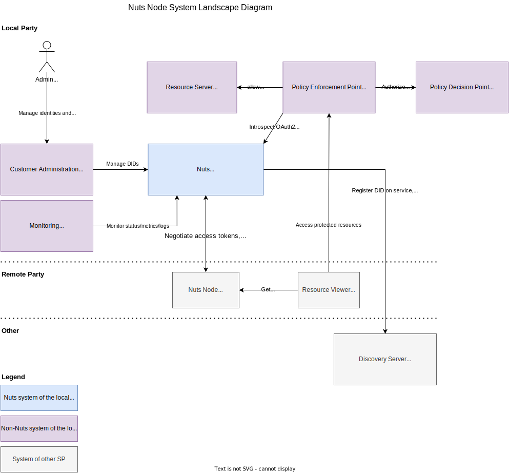

.. _nuts-node-recommended-deployment:

Recommended Deployment
######################

This document describes the systems and their components involved in deploying a Nuts node in a production environment.
The target audience are engineers that want to deploy a Nuts Node.

It does not detail services and interfaces specified by use cases: those should be documented by the particular use case and should be regarded as extensions to the deployment described here.

The container diagram documents the recommended way of deploying a Nuts node using the features supported by the Nuts node's version.

The diagrams are in `C4 model <https://c4model.com/>`_ notation.

System Landscape
****************

The diagram below depicts the actors that interact with the Nuts node of the local party.

Containers
**********

This section details the system with involved containers (which can be native or containerized processes, physical or remote database servers).
It lists the interfaces of the Nuts node, who uses them and how they should be secured.

.. image:: ../../_static/images/diagrams/deployment-diagram-Container-Diagram.svg

Nuts Node
^^^^^^^^^

Server that implements the Nuts specification that connects to the Nuts network. It will usually run as Docker container or Kubernetes pod.

It is interacted with through HTTP by internal and external actors. Internal actors typically include:

* Administrative applications (e.g. customer management application in a multi-tenant environment)
* Ops tooling (e.g. metric collectors)
* Resource viewer/consumer application that wants to access protected resources at a remote party

The APIs these internal actors use are on the "internal" HTTP interface, which is bound to ``127.0.0.1:8081`` by default.

External actors typically include:

* Verifiable Credential issuers, verifiers and/or wallets
* OAuth2 client applications (e.g. a viewer accessing a protected resource on the Resource Server)

The APIs these external actors use are on the "public" HTTP interface, which is bound to ``:8080`` by default.

Public Endpoints
----------------
This section describes HTTP endpoints that need to be reachable for third parties.
These HTTP endpoints are available on ``:8080``.

* **/iam**: for resolving DID documents.

   *Users*: Verifiable Credential issuers and verifiers, OAuth2 client applications (e.g. other Nuts nodes, resource viewers)

   *Security*: HTTPS with **publicly trusted** server certificate (on proxy).

* **/oauth2**: for accessing OAuth2 and OpenID services.

   *Users*: Verifiable Credential issuers and verifiers, OAuth2 client applications (e.g. other Nuts nodes, resource viewers)

   *Security*: HTTPS with **publicly trusted** server certificate (on proxy). Monitor traffic to detect attacks.

* **/.well-known**: for resolving DID documents, OpenID and OAuth2 metadata

   *Users*: Other Nuts nodes, Verifiable Credential issuers and verifiers.

   *Security*: HTTPS with **publicly trusted** server certificate (on proxy).

* **/statuslist**: for retrieving the Verifiable Credential revocations.

   *Users*: Verifiable Credential verifiers (e.g. other Nuts nodes).

   *Security*: HTTPS with **publicly trusted** server certificate (on proxy).

Internal Endpoints
------------------
This section describes HTTP endpoints that must only be reachable by your own applications integrating with the Nuts node.
These endpoints are by default available on ``127.0.0.1:8081``.
If you need to access them from another host, you can bind it to a different interface (e.g. ``:8081`` for all interfaces).

* **/internal**: for managing everything related to DIDs, VCs and the Nuts Node itself. Very sensitive endpoints with no additional built-in security, so care should be taken that no unauthorized parties can access it.

   *Users*: operators, administrative and resource owner applications.

   *Security*: restrict access through network separation and platform authentication.

* **/status**: for inspecting the health of the server, returns ``OK`` if healthy.

   *Users*: monitoring tooling.

   *Security*: restrict access through network separation.

* **/status/diagnostics**: for inspecting diagnostic information of the server.

   *Users*: monitoring tooling, system administrators.

   *Security*: restrict access through network separation.

* **/metrics**: for scraping metrics in Prometheus format.

   *Users*: monitoring/metrics tooling.

   *Security*: restrict access through network separation.

* **/health:** for checking the health of the server, returns ``OK`` if healthy.

   *Users*: Docker or Kubernetes health checks.

   *Security*: restrict access through network separation.

Legacy Endpoints
----------------

There are deprecated endpoints that are still supported for backwards compatibility.
If your use case does not require ``did:nuts`` DIDs and/or the gRPC network, you can limit/disable access to these endpoints.

* **/n2n** (public): for providing Nuts services to other nodes (e.g. creating access tokens).
   The local node also calls other nodes on their ``/n2n`` endpoint, these outgoing calls are subject to the same security requirements.

   *Users*: Other Nuts nodes.

   *Security*: HTTPS with server- and client certificates (mTLS) **according to network trust anchors** (on proxy). Monitor traffic to detect attacks.

* **/public** (public): for accessing public services, e.g. IRMA authentication.

   *Users*: IRMA app.

   *Security*: HTTPS with **publicly trusted** server certificate (on proxy). Monitor traffic to detect attacks.

* **gRPC**: for communicating with other Nuts nodes according to the network protocol. Uses HTTP/2 on port ``5555`` as transport, both outbound and inbound.

   *Users*: Other Nuts nodes.

   *Security*: HTTPS with server- and client certificates (mTLS) **according to network trust anchors** (on proxy). This is provided by the Nuts node.

Proxy / API Gateway
^^^^^^^^^^^^^^^^^^^

Process that protects and routes HTTP (specified above) to the Nuts Node.
Typically a standalone HTTP proxy (e.g. NGINX or HAProxy) that resides in a DMZ and/or an ingress service on a cloud platform.
It will act as TLS terminator.

The Nuts Node looks for a header called ``X-Forwarded-For`` to determine the client IP when logging calls.
Refer to the documentation of your proxy on how to set this header.

This process can also act as API Gateway to give external parties access to the Resource Server.
This API Gateway should then introspect the OAuth2 access token at the Nuts node and perform additional authorization checks (depending on the use case).

Data storage
^^^^^^^^^^^^

Primary data storage for all persistent data other than private keys. By default, it stores data on-disk using SQLite.
For production, MySQL or Postgres is recommended.

Private Key Storage
^^^^^^^^^^^^^^^^^^^

Creating DID documents causes private keys to be generated, which need to be safely stored so the Nuts node can access them.
It is recommended to store them in `Vault <https://www.vaultproject.io/>`_ or other secure key store.
Refer to the config options of the crypto engine and `Vault documentation <https://www.vaultproject.io/docs>`_ for configuring it.

Production Checklist
********************

Below is a list of items that should be addressed when running a node in production:

- Reverse proxy
   - Use a proxy in front of the node which terminates TLS
   - Make sure the reverse proxy sends the ``X-Forwarded-For`` header to log correct IP addresses
- Key Management
   - Have a scheduled key rotation procedure
- Backup Management
   - Make sure data is backed up (data stored in SQL and private keys)
   - Have a tested backup/restore procedure
- Configuration
   - Make sure ``strictmode`` is enabled (default)
- Security
   - If not using ``did:nuts``, prevent access to:
      - The gRPC endpoint (e.g. by not mapping it in Docker).
      - The public ``/n2n`` and ``/public`` endpoints on HTTP ``:8080``. See the v5 documentation for deployments still using ``did:nuts``.
   - Make sure internal HTTP endpoints (``:8081``) are not available from the outside.
   - Consider protecting ``/internal`` with API authentication.
- Availability
   - Consider (D)DoS detection and protection for the ``/oauth2`` HTTP endpoints.